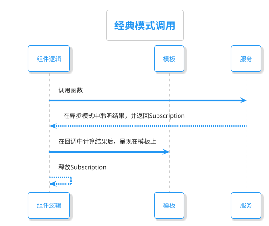
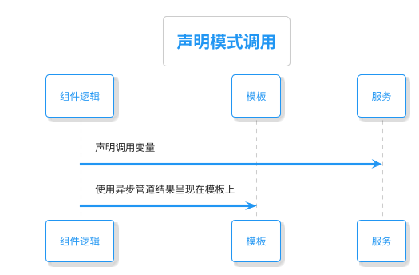

#RxJS异步模式在Angular中的使用

## 1. 设定我们有如下的Service定义：

```typescript
export class TodoService {
  private todoUrl = '/api/todo?id=1';

  constructor(private http: HttpClient) {}

   // 经典模式
   getTodo(): Observable<ToDo> {
    return this.http.get(this.todoUrl).pipe(tap(console.log));
  }

  // 声明性模式
  todo$ = this.http.get(this.todoUrl).pipe(tap(console.log));

```

## 2. 经典模式使用
  - 2.1. 我们可以通过如下方式调用
```typescript
subscription: Subscription;
data: ToDo;
```

```typescript
    this.subscription = this.todoService
      .getTodo()
      .subscribe((todo) => (this.data = todo));
    console.log(this.data);
```

```typescript
    this.subscription.unsubscribe();
```


  - 2.2. 在模板中可以这样：
```html
// app.component.html
<div *ngIf="data">
  {{ data.title }}
</div>
```


## 3. 声明性模式使用
  - 3.1. 我们可以通过如下方式调用
```typescript
data$ = this.todoService.todo$;
```

  - 3.2. 在模板中可以这样：
```html
// app.component.html
<div *ngIf="data$ | async as data">
  {{ data.title }}
</div>
```






